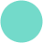
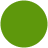
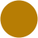
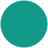

# Voltaic

A lime-on-zinc theme in two flavours, dark and light, with a single palette shared
across every application that supports custom colours.

The palette in `palette.json` is the source of truth. Every per-application theme
in this repo is derived from it. Change a colour there, regenerate the ports.

The [style guide](docs/style-guide.md) says which colour does which job, so that a
status bar in one app means what it means in another. Read it before writing a
port.

## Flavours

| Flavour | Background | Accent | Feel |
| --- | --- | --- | --- |
| Voltaic Dark | `#09090b` | `#c8ff00` | Near-black zinc with an electric lime accent |
| Voltaic Light | `#f0efed` | `#4c790f` | Warm off-white paper with a deep olive accent |

## Palette

Colours come in two groups. **Accents** carry meaning (syntax, status, git state).
The **monochrome ramp** runs from background to brightest foreground, and mirrors
itself between flavours: `base` is the darkest tone in dark and the lightest in
light.

### Voltaic Dark

Accents:

| Colour | Hex | RGB | HSL | Role |
| --- | --- | --- | --- | --- |
|  `volt` | `#c8ff00` | `rgb(200, 255, 0)` | `hsl(73, 100%, 50%)` | Signature accent: keywords, cursor, focus ring |
|  `arc` | `#a3e635` | `rgb(163, 230, 53)` | `hsl(83, 78%, 55%)` | Accent text and icons, shimmer |
|  `lime` | `#a3e635` | `rgb(163, 230, 53)` | `hsl(83, 78%, 55%)` | Bright green |
|  `jade` | `#10b981` | `rgb(16, 185, 129)` | `hsl(160, 84%, 39%)` | Strings, namespaces, success |
|  `ember` | `#f7768e` | `rgb(247, 118, 142)` | `hsl(349, 89%, 72%)` | Errors, numbers, deletions, tags |
|  `flare` | `#ff9e9e` | `rgb(255, 158, 158)` | `hsl(0, 100%, 81%)` | Bright red |
|  `amber` | `#e0af68` | `rgb(224, 175, 104)` | `hsl(36, 66%, 64%)` | Warnings, constants, modified |
|  `gold` | `#e0af68` | `rgb(224, 175, 104)` | `hsl(36, 66%, 64%)` | Bright yellow |
|  `bronze` | `#b9a58c` | `rgb(185, 165, 140)` | `hsl(33, 24%, 64%)` | Properties, struct members |
|  `blue` | `#7aa2f7` | `rgb(122, 162, 247)` | `hsl(221, 89%, 72%)` | Functions, info, directories |
|  `sky` | `#a9c4ff` | `rgb(169, 196, 255)` | `hsl(221, 100%, 83%)` | Bright blue |
|  `cyan` | `#2ac3de` | `rgb(42, 195, 222)` | `hsl(189, 73%, 52%)` | Types, constructors, enums |
|  `ice` | `#89ddff` | `rgb(137, 221, 255)` | `hsl(197, 100%, 77%)` | Operators (neutral in light, where the blue band is full) |
|  `teal` | `#73daca` | `rgb(115, 218, 202)` | `hsl(171, 58%, 65%)` | Links, symlinks, filters |
|  `aqua` | `#73daca` | `rgb(115, 218, 202)` | `hsl(171, 58%, 65%)` | Bright cyan |
|  `violet` | `#bb9af7` | `rgb(187, 154, 247)` | `hsl(261, 85%, 79%)` | Preprocessor, merge conflicts |
|  `lilac` | `#d4bff0` | `rgb(212, 191, 240)` | `hsl(266, 62%, 85%)` | Bright magenta |

Monochrome ramp:

| Colour | Hex | RGB | HSL | Role |
| --- | --- | --- | --- | --- |
|  `base` | `#09090b` | `rgb(9, 9, 11)` | `hsl(240, 10%, 4%)` | App background |
|  `deep` | `#0c0a09` | `rgb(12, 10, 9)` | `hsl(20, 14%, 4%)` | Editor / terminal background |
|  `surface` | `#18181b` | `rgb(24, 24, 27)` | `hsl(240, 6%, 10%)` | Panels, dialogs, elevated surfaces |
|  `overlay` | `#27272a` | `rgb(39, 39, 42)` | `hsl(240, 4%, 16%)` | Borders, hover, active row |
|  `muted` | `#3f3f46` | `rgb(63, 63, 70)` | `hsl(240, 5%, 26%)` | Indent guides, disabled icons |
|  `dim` | `#52525b` | `rgb(82, 82, 91)` | `hsl(240, 5%, 34%)` | Placeholders, disabled text, line numbers |
|  `subtle` | `#787881` | `rgb(120, 120, 129)` | `hsl(240, 4%, 49%)` | Comments, punctuation, ignored files |
|  `soft` | `#a1a1aa` | `rgb(161, 161, 170)` | `hsl(240, 5%, 65%)` | Secondary text, hints |
|  `text` | `#d4d4d8` | `rgb(212, 212, 216)` | `hsl(240, 5%, 84%)` | Primary text |
|  `bright` | `#fafafa` | `rgb(250, 250, 250)` | `hsl(0, 0%, 98%)` | Emphasised text, bright white |

### Voltaic Light

Accents:

| Colour | Hex | RGB | HSL | Role |
| --- | --- | --- | --- | --- |
|  `volt` | `#4c790f` | `rgb(76, 121, 15)` | `hsl(85, 78%, 27%)` | Signature accent: keywords, cursor, focus ring |
|  `arc` | `#3f6212` | `rgb(63, 98, 18)` | `hsl(86, 69%, 23%)` | Accent text and icons, shimmer |
|  `lime` | `#5e980c` | `rgb(94, 152, 12)` | `hsl(85, 85%, 32%)` | Bright green |
|  `jade` | `#047857` | `rgb(4, 120, 87)` | `hsl(163, 94%, 24%)` | Strings, namespaces, success |
|  `ember` | `#be123c` | `rgb(190, 18, 60)` | `hsl(345, 83%, 41%)` | Errors, numbers, deletions, tags |
|  `flare` | `#e11d48` | `rgb(225, 29, 72)` | `hsl(347, 77%, 50%)` | Bright red |
|  `amber` | `#9c5f07` | `rgb(156, 95, 7)` | `hsl(35, 91%, 32%)` | Warnings, constants, modified |
|  `gold` | `#b77d04` | `rgb(183, 125, 4)` | `hsl(41, 96%, 37%)` | Bright yellow |
|  `bronze` | `#92400e` | `rgb(146, 64, 14)` | `hsl(23, 82%, 31%)` | Properties, struct members |
|  `blue` | `#1d4ed8` | `rgb(29, 78, 216)` | `hsl(224, 76%, 48%)` | Functions, info, directories |
|  `sky` | `#3b82f6` | `rgb(59, 130, 246)` | `hsl(217, 91%, 60%)` | Bright blue |
|  `cyan` | `#0e7490` | `rgb(14, 116, 144)` | `hsl(193, 82%, 31%)` | Types, constructors, enums |
|  `ice` | `#52525b` | `rgb(82, 82, 91)` | `hsl(240, 5%, 34%)` | Operators (neutral in light, where the blue band is full) |
|  `teal` | `#0f766e` | `rgb(15, 118, 110)` | `hsl(175, 77%, 26%)` | Links, symlinks, filters |
|  `aqua` | `#11998a` | `rgb(17, 153, 138)` | `hsl(173, 80%, 33%)` | Bright cyan |
|  `violet` | `#7c3aed` | `rgb(124, 58, 237)` | `hsl(262, 83%, 58%)` | Preprocessor, merge conflicts |
|  `lilac` | `#8b5cf6` | `rgb(139, 92, 246)` | `hsl(258, 90%, 66%)` | Bright magenta |

Monochrome ramp:

| Colour | Hex | RGB | HSL | Role |
| --- | --- | --- | --- | --- |
|  `base` | `#f0efed` | `rgb(240, 239, 237)` | `hsl(40, 9%, 94%)` | App background |
|  `deep` | `#faf9f7` | `rgb(250, 249, 247)` | `hsl(40, 23%, 97%)` | Editor / terminal background |
|  `surface` | `#ffffff` | `rgb(255, 255, 255)` | `hsl(0, 0%, 100%)` | Panels, dialogs, elevated surfaces |
|  `overlay` | `#e4e4e7` | `rgb(228, 228, 231)` | `hsl(240, 6%, 90%)` | Borders, hover, active row |
|  `muted` | `#d4d4d8` | `rgb(212, 212, 216)` | `hsl(240, 5%, 84%)` | Indent guides, disabled icons |
|  `dim` | `#a1a1aa` | `rgb(161, 161, 170)` | `hsl(240, 5%, 65%)` | Placeholders, disabled text, line numbers |
|  `subtle` | `#6c6c75` | `rgb(108, 108, 117)` | `hsl(240, 4%, 44%)` | Comments, punctuation, ignored files |
|  `soft` | `#52525b` | `rgb(82, 82, 91)` | `hsl(240, 5%, 34%)` | Secondary text, hints |
|  `text` | `#3f3f46` | `rgb(63, 63, 70)` | `hsl(240, 5%, 26%)` | Primary text |
|  `bright` | `#27272a` | `rgb(39, 39, 42)` | `hsl(240, 4%, 16%)` | Emphasised text, bright white |

## Terminal (ANSI)

Terminal emulators want sixteen slots. Both flavours map them from the palette
by name, so a port never hardcodes a hex.

| Slot | Dark | Light |
| --- | --- | --- |
| 0 black | `dim` | `bright` |
| 1 red | `ember` | `ember` |
| 2 green | `volt` | `volt` |
| 3 yellow | `amber` | `amber` |
| 4 blue | `blue` | `blue` |
| 5 magenta | `violet` | `violet` |
| 6 cyan | `teal` | `teal` |
| 7 white | `text` | `soft` |
| 8 bright black | `subtle` | `subtle` |
| 9 bright red | `flare` | `flare` |
| 10 bright green | `lime` | `lime` |
| 11 bright yellow | `gold` | `gold` |
| 12 bright blue | `sky` | `sky` |
| 13 bright magenta | `lilac` | `lilac` |
| 14 bright cyan | `aqua` | `aqua` |
| 15 bright white | `bright` | `text` |

Both greyscale ends run dark in the light flavour. Taking slots 7 and 15 literally
and mapping them to near-white makes anything printed as "white" invisible on a
light background, so they map to `soft` and `text` instead.

Slot 0 is the darkest tone that is not the background. In light that is `bright`;
in dark it is `dim` rather than `deep`, because `deep` is the terminal canvas and
anything printed in it would be invisible.

Some names collapse to the same hex within one flavour. In dark, `arc` and `lime`
are both `#a3e635`, `amber` and `gold` are both `#e0af68`, `teal` and `aqua` are
both `#73daca`. They stay separate names because they diverge in light.

## Contrast

Every colour that renders as text clears 4.5:1 against its flavour's `base`.
The six ANSI bright accents (`lime`, `gold`, `aqua`, `flare`, `sky`, `lilac`)
clear 3:1, the WCAG floor for emphasis and chrome rather than body text.
Backgrounds and the deliberately quiet tones (`overlay`, `muted`, `dim`) are
exempt, since low contrast is their job.

`check.py` enforces this, along with the derived RGB and HSL values matching their
hex, every ANSI slot resolving to a real colour name, and the generated artefacts
being current. Run it before committing a palette change:

```
./check.py
```

Several hexes look like they missed a round Tailwind value by a digit or two:
light `volt` is `#4c790f` rather than `#4d7a0f`, light `amber` is `#9c5f07`
rather than `#a16207`. Those are the contrast floor, not typos. `check.py` fails
if they get tidied back.

The light flavour is the constrained one. On a background at 94% lightness there
is not enough room for seventeen accents that are all both readable and mutually
distinguishable, which is why its bright tier sits at the lower floor.

## Repository layout

```
palette.json        Source of truth: both flavours, every colour, ANSI mapping
build.py            Regenerates the swatches and the README colour tables
check.py            Validates the palette and that the generated files are current
README.md           This file
LICENCE             MIT
docs/
  style-guide.md    Which colour to use for which job, when writing a port
assets/palette/
  circles/          One 48px PNG swatch per colour, <flavour>-<name>.png
<app>/              One directory per application
  README.md         How to install and enable the theme for that app
  <theme files>     Generated from palette.json
```

Edit `palette.json`, then run `./build.py` to regenerate everything downstream of
it and `./check.py` to confirm the result holds. The swatch PNGs are written by
`build.py` using nothing but the standard library, so there is no toolchain to
install. Do not hand-edit the colour tables in this file; `build.py` overwrites
them and `check.py` fails if they have drifted.

Applications to port, and where the current hand-maintained version lives:

| App | Current location |
| --- | --- |
| vscode | `vscode-theme-my-brand/themes/` |
| zed | `dotfiles/packages/zed/.config/zed/themes/voltaic.json` |
| ghostty | `dotfiles/packages/ghostty/.config/ghostty/themes/` |
| k9s | `dotfiles/packages/k9s/.config/k9s/skins/voltaic-dark.yaml` |
| starship | `dotfiles/packages/starship/.config/starship/starship.toml` |
| eza | `dotfiles/packages/eza/.config/eza/theme.yml` |
| claude | `dotfiles/packages/claude/.claude/themes/voltaic-dark.json` |
| herdr | `dotfiles/packages/herdr/.config/herdr/config.toml` |

Each directory lands with its port. None of them exist yet.

## Known drift

The palette was reverse-engineered from the existing hand-maintained themes, which
had picked up colours that belong to no consistent family. These need a decision
before the ports are generated:

| Hex | Where it appears | Resolution |
| --- | --- | --- |
| `#caea28` | Signature accent in every port | `volt`, `#c8ff00` |
| `#71717a` | ANSI bright black, pipes, inactive and description text | `subtle` |
| `#f59e0b` | Warnings in starship, herdr and claude | `amber` |
| `#ff6b80` | Errors in herdr and claude | `ember` |
| `#fcd34d` | Warning shimmer in claude | `gold` |
| `#c0a36e` | Five syntax scopes in vscode | `bronze` |
| `#6d28d9` | Light violet in vscode | `violet` |
| `#f5f5f4` | Light tab bar background in vscode | `base` |
| `#d97757` | Claude marker in starship | Anthropic brand orange, not a theme colour. `bronze`, or keep the literal |

Regenerate with `rg -o '#[0-9a-fA-F]{6}' <theme file>` and compare against
`palette.json`; anything not in it is either drift or a composited tint.

Every port also predates the contrast fixes in `palette.json`, so the six light
accents and two dark ones that moved will differ from what is currently installed.
That resolves itself when each port is generated.

Diff and selection backgrounds are resolved: they are accents composited over the
background at one of the five steps in the
[style guide](docs/style-guide.md#tints-and-overlays), not palette entries.

## Licence

[MIT](LICENCE)
