# Style guide

How to apply the Voltaic palette. Every port should make the same decision for the
same job, so that a status bar in one app means what it means in another.

Swatches show dark then light. Colour names are defined in
[`palette.json`](../palette.json) and tabulated in the [README](../README.md).

Legibility wins over consistency. Where a rule here produces something unreadable
in a particular app, deviate and say so in that port's README.

## Backgrounds and structure

| Function | Colour | |
| --- | --- | --- |
| Editor and terminal canvas | `deep` |  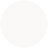 |
| Application and window background | `base` |   |
| Panels, dialogs, elevated surfaces | `surface` | 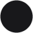  |
| Borders, hover states, active row | `overlay` |   |
| Focused border, active pane, focus ring | `volt` | 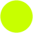  |
| Indent guides, rules, separators | `muted` |   |

## Tints and overlays

Translucent fills are the largest single category of colour in an editor theme and
the easiest place for ports to drift. The hand-built themes used ten different
opacity values; these five replace them. Do not invent a sixth.

| Step | Opacity | `volt` as 8-digit | `volt` over `base` (dark) | Typical use |
| --- | --- | --- | --- | --- |
| `faint` | 8% | `#c8ff0014` | `#181d0a` | Scrollbar thumbs, drop targets, inactive marks |
| `wash` | 14% | `#c8ff0024` | `#242b09` | Scrollbar thumb hover, subtle row highlight |
| `tint` | 20% | `#c8ff0033` | `#2f3a09` | Selections, search matches, read highlights, diff backgrounds |
| `veil` | 30% | `#c8ff004c` | `#425308` | Active line, write highlights, stronger emphasis |
| `heavy` | 50% | `#c8ff0080` | `#688406` | Overview ruler marks, find-match borders. Never behind text |

Ports that accept an alpha channel take the 8-digit form directly. Ports that do
not, which is most terminal tooling, take the composited opaque value instead.
`build.py` provides `rgba()` and `composite()` for both. Compositing blends in
sRGB rather than linear light, matching what the consuming applications do.

Two constraints are load-bearing, and `check.py` enforces the first:

**Nothing readable sits on `heavy`.** At 50% over dark `base`, `volt` drops body
text to 2.90:1. It is for marks and borders, never a background behind text.

**In light, tint with a foreground tone or step the background, never tint with a
background tone.** `overlay` at any alpha composites to within a hair of `base`,
because the top of the light ramp is compressed. Two things that do work: `text`
at `faint`, or `overlay` as an opaque fill. The active line uses the latter, a
1.21:1 step off the `deep` canvas.

Expect that band. A light-theme active line lands somewhere around 1.1-1.3:1
whichever technique is used, and Catppuccin Latte sits at 1.11:1 doing the same
job with `text` at 7%. It is a genre constraint, not a defect to engineer away.

## Typography

| Function | Colour | |
| --- | --- | --- |
| Body copy, primary text | `text` |   |
| Emphasised text, headings | `bright` | 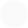  |
| Secondary text, hints, labels | `soft` |   |
| Comments, punctuation, ignored files | `subtle` |   |
| Placeholders, disabled text, line numbers | `dim` |   |
| Accent text and icons | `arc` | 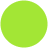  |
| Text on an accent fill | `deep` |   |
| Links and URLs | `blue` |   |

`arc` rather than `volt` carries accent *text*. In light it is the darker of the
two and clears AA comfortably, where `volt` only just does. Reserve `volt` for
fills, cursors and focus rings, where it is a shape rather than a glyph.

## Status and version control

| Function | Colour | |
| --- | --- | --- |
| Success, passing, merged | `jade` | 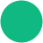  |
| Error, failure, killed | `ember` | 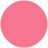  |
| Warning, pending | `amber` | 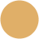 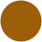 |
| Information, new | `blue` |   |
| Hint | `soft` |   |
| Merge conflict | `violet` | 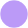 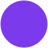 |
| Added, created, untracked | `jade` |   |
| Modified, renamed | `amber` |   |
| Deleted | `ember` |   |
| Ignored, hidden | `subtle` |   |

Success is `jade`, not `volt`. The accent colour has to stay readable as "this is
Voltaic" rather than "this worked", and it is already doing duty as the cursor,
the focus ring and the keyword colour. The Zed and VS Code themes currently use
`volt` for success and created, which is drift to fix when they are regenerated.

## Ordered series

Charts, gauges and sparklines ask for several colours at once. Two rules cover it.

**A series that means something is not a series.** Pass and fail take `jade` and
`ember`. Normal, warning and critical take `jade`, `amber`, `ember`. Reach for the
rotation below only when the entries differ in identity rather than in state.

**Otherwise take the rotation in order**, stopping when you have enough:

| # | Colour | |
| --- | --- | --- |
| 1 | `blue` |   |
| 2 | `teal` |   |
| 3 | `bronze` | 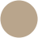 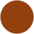 |
| 4 | `ice` |   |
| 5 | `lilac` | 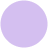 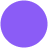 |

Every pair is at least 15.3 dE apart in both flavours, so any prefix of the
rotation stays separated. The status colours are absent so that a categorical
series never reads as a state it does not have, and `volt` and `arc` are absent
because they carry chrome in every port and a series in them reads as furniture.

**The bright tier is not a second step.** `arc` and `lime`, `amber` and `gold`,
`teal` and `aqua` are the same hex in the dark flavour. A second series takes the
next entry in the rotation, never a lighter version of the first.

## File kinds

For anything that colours a directory listing.

| Kind | Colour | |
| --- | --- | --- |
| Regular files | `text` |   |
| Directories | `blue` |   |
| Symlinks | `teal` |   |
| Executables | `volt` |   |
| Pipes and FIFOs | `subtle` |   |
| Sockets | `dim` |   |
| Block and character devices | `flare` | 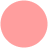  |
| Special files | `violet` |   |
| Mount points | `sky` | 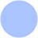  |

## Listing metadata

The columns beside the filename: ownership, permission bits, size and age.

| Function | Colour | |
| --- | --- | --- |
| Your user and group | `bright`, `text` |   |
| Another user's | `soft` |   |
| Root | `ember` |   |
| Write bit | `amber` |   |
| Execute bit | `volt` |   |
| Dates, inodes, block counts, octal modes | `soft` |   |

Permissions read as a grid rather than a sentence, so the read bit takes the owner
tier from the table above and the other two carry their own meaning: `amber` warns
that something is writable, `volt` matches the executable file kind.

**The size ramp escalates.** A file size is ordinal, not categorical, so it takes
one colour per magnitude and gets louder as the number grows. The unit takes the
same colour as its number, so `4.2M` reads as one token.

| Magnitude | Colour | |
| --- | --- | --- |
| Bytes | `soft` |   |
| Kilo | `text` |   |
| Mega | `blue` |   |
| Giga | `amber` |   |
| Tera and beyond | `ember` |   |

Version control columns take the [status colours](#status-and-version-control)
unchanged. Type changes, where a file becomes a directory or a symlink, take
`cyan`: the status table has no entry for them, and the thing that changed is the
file's type.

## Terminal

| Function | Colour | |
| --- | --- | --- |
| Cursor | `volt` |   |
| Cursor text | `deep` |   |
| Selection background | `volt` |   |
| Selection text | `deep` |   |
| Active border | `volt` |   |
| Inactive border | `overlay` |   |

Terminal selection is a solid `volt` fill with `deep` text on top, at 16.7:1. That
is deliberately louder than the editor treatment below, because a terminal
selection is transient and usually a single line.

### ANSI

The sixteen slots are mapped in the [README](../README.md#terminal-ansi). Two
rules matter when porting.

**Bright does not mean lighter.** It means bolder and more saturated. Voltaic's
bright accents clear 3:1 rather than 4.5:1, because they carry emphasis and chrome
rather than body text. In the light flavour this is load-bearing: making the
bright tier literally lighter is what put ANSI white at 1.29:1 in the original
hand-built themes.

**The greyscale ends run dark in the light flavour.** Slots 7 and 15 map to `soft`
and `text`, not to near-white. Taking "white" literally on a light background
makes anything printed in it invisible. Catppuccin goes the other way here and
maps Latte's white slots to its light surfaces, so this is a deliberate
divergence, not an oversight.

## Syntax

| Syntax | Colour | |
| --- | --- | --- |
| Keywords | `volt` |   |
| Strings | `jade` |   |
| Numbers, booleans | `ember` |   |
| Constants, enum members | `amber` |   |
| Functions, methods | `blue` |   |
| Types, classes, constructors | `cyan` |   |
| Operators | `ice` |   |
| Object properties, config keys | `blue` |   |
| Struct fields, members | `bronze` |
| Variables, identifiers | `text` |   |
| Namespaces, modules | `jade` |   |
| Tags | `ember` |   |
| Attributes | `amber` |   |
| Escape sequences | `ember` |   |
| Regular expressions | `amber` |   |
| Preprocessor, macros | `violet` |   |
| Comments | `subtle` |   |
| Punctuation, delimiters | `subtle` |   |
| Brackets, braces | `soft` |   |

Editor selection is `volt` at roughly 15% over `base`, unlike the solid terminal
fill, because an editor selection can span a whole screen and a solid accent that
size is punishing.

`ice` is the one colour that changes character between flavours. In dark it is a
bright cyan; in light it is the same neutral grey as `soft`, because the light
blue band is already full with `cyan`, `blue` and `teal` and a fourth entry cannot
clear AA while staying distinguishable from all three. Operators are punctuation
more than they are words, so going neutral costs less than going unreadable.

Config keys are `blue`, not `bronze`. In a JSON or YAML file every key is a
`property`, so putting properties on `bronze` leaves whole files rendering in two
colours against `jade` strings. `bronze` keeps struct fields and members, where it
sits beside `amber` constants often enough to need the dE 12.7 separation between
them. Do not nudge either toward the other when porting.

## Markup

| Element | Colour | |
| --- | --- | --- |
| Headings | `volt` |   |
| Emphasis | `jade` |   |
| Strong emphasis | `amber` |   |
| Inline code, literals | `amber` |   |
| Link text | `blue` |   |
| Link URL | `cyan` |   |
| List markers | `ember` |   |
| Block quotes | `subtle` |   |
